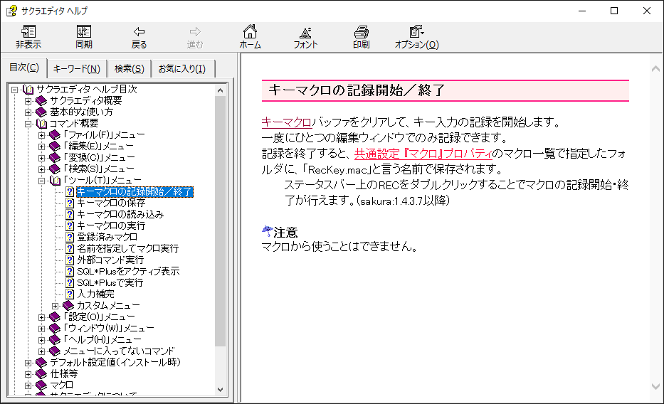
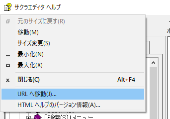
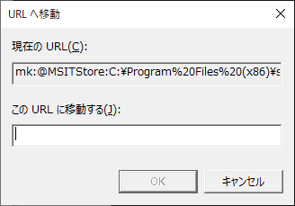

# Sharing help document

.chm ファイル形式のヘルプドキュメント内の、  
*この項目を見てくれ* ということをあなたの同僚に伝えたいとき、どうすればよいだろうか。  

## 汎用的ではない方法

パッと思いつく方法としては、  
画面左側の目次タブのツリーから、目的のページをたどることができれば、そのツリーのメモやスクリーンキャプチャを送ればいいだろう。  

例えば、  
サクラエディタの `キーマクロの記録開始／終了` 機能のドキュメントは、下図のような感じだ。

  

このスクリーンキャプチャを使うか、目次タブ内のツリーパスをメモればいいが、  
キャプチャすると文字情報が失われるし、ツリーパスをメモろうにも、残念なことに、全てのページが目次タブに紐付けられているとは限らない。  

## 汎用的な方法

一般的な .chm ファイルなら、現在見ているページの PC 内でのパスを表す文字列を取得できる。  

Open widow menu (by `Alt` + `Space`) -> Select `URLへ移動...`  

  

`URLへ移動` ダイアログが表示される。  
`現在のURL` の項目が、今見ているページを特定する PC 内での URL だ。  




筆者の環境では、この例で見ている `キーマクロの記録開始／終了` のドキュメントページを表す URL は以下となった。  

```
mk:@MSITStore:C:\Program%20Files%20(x86)\sakura\sakura.chm::/_RESOURCE/HLP000125.html
```

.chm ファイルまでのパスと、.chm ファイルを展開したディレクトリ構成内でのパスという構成になっているのがわかる。  
上記の `~\Program%20Files%20(x86)\sakura` までのパスが サクラエディタのインストールパスとなっているから、これ以降の文字列を、ページを特定する文字列として扱うのがいいだろう。  
たとえば、以下の様な具合に。  

```
"<Sakura Install Path>\sakura.chm::/_RESOURCE/HLP000125.html"
```
