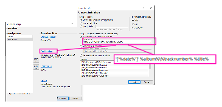
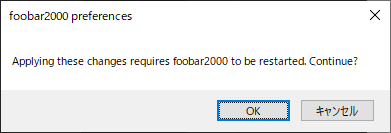
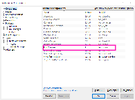

## Like Settings

Converter Setup



## コマンドラインから foobar 2000 をコントロール

### 準備

#### Run Command をインストール

1. https://www.foobar2000.org/components/view/foo_runcmd から foo_runcmd-1.1-20100107.zip をダウンロード
2. foobar2000 を起動して File -> Preferences -> Components -> Install...  
   ダウンロードした foo_runcmd-1.1-20100107.zip を選択して開く -> Apply 


  
-> OK  

File -> Preferences -> Components に、以下のように "Run Command" が追加されていれば OK  
  

# Run

e.g.  
```
"C:\Program Files (x86)\foobar2000\foobar2000.exe" /runcmd-files="Tagging/Remove tags from file(s)" "G:\bkmusics\Raw\h 堀江由衣3\[2004] スクランブル\01 スクランブル.wav"
"C:\Program Files (x86)\foobar2000\foobar2000.exe" /runcmd-files="Tagging/Remove tags from file(s)" "G:\bkmusics\Raw\h 堀江由衣3\[2004] スクランブル\02 Go! Go! Golden Days.wav"
```
