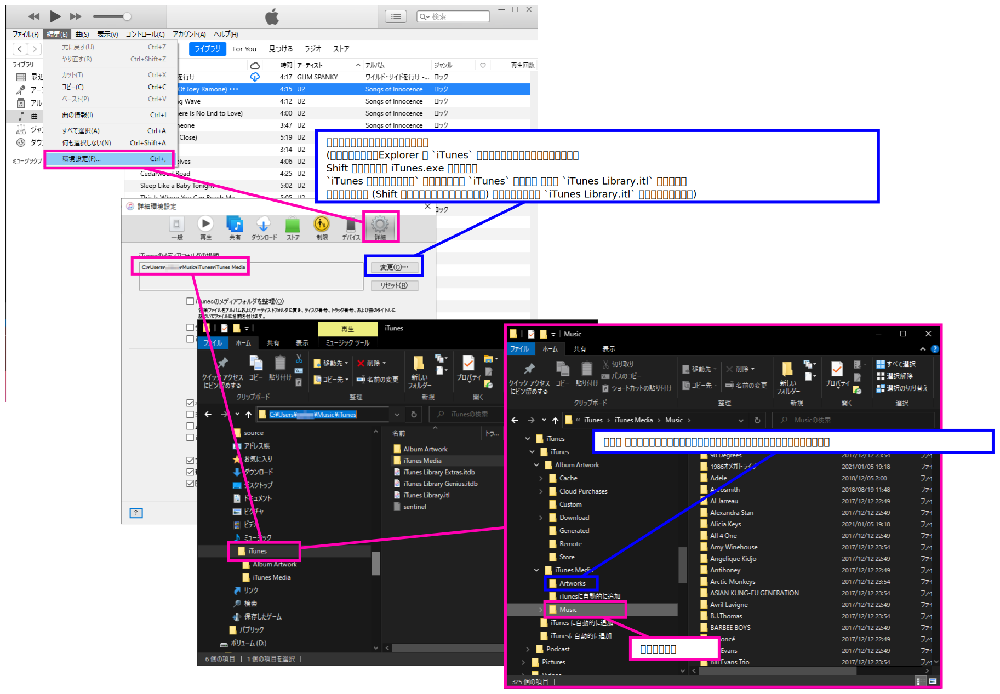
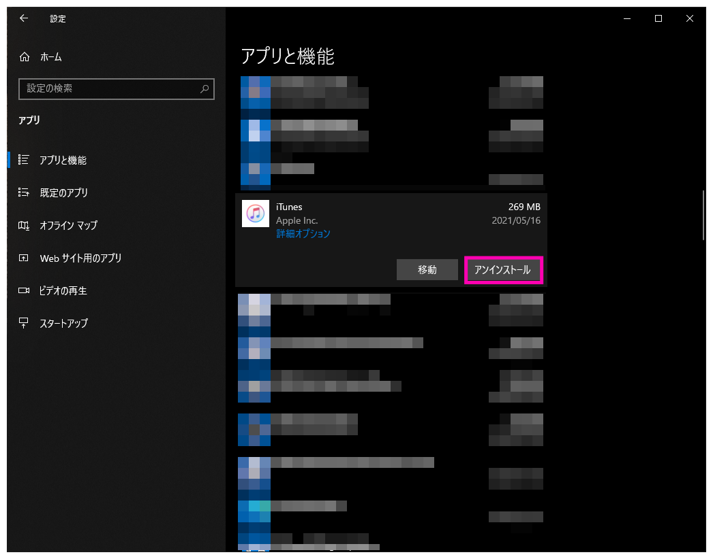

# メディアライブラリの構成

  


## ディレクトリー構成

```
├─iTunes
│  │  iTunes Library Extras.itdb
│  │  iTunes Library Genius.itdb
│  │  iTunes Library.itl
│  │  
│  ├─Album Artwork
│  │  ├─Cache
│  │  │  └─D9AAA407B2B511A9
│  │  │      ├─00
│  │  │      │  ├─00
│  │  │      │  │  └─00
│  │  │      │  │          D9AAA407B2B511A9-DD8413FFF7975000.itc2
│  │  │      │  │          
(...)
│  │  │          │          
│  │  │          └─15
│  │  │              ├─01
│  │  │              │      D9AAA407B2B511A9-49CBE855E035C1FF.itc2
│  │  │              │      
│  │  │              ├─02
│  │  │              │      D9AAA407B2B511A9-31E571AA697602FF.itc2
│  │  │              │      
│  │  │              └─07
│  │  │                      D9AAA407B2B511A9-6A214EAE6563B7FF.itc2
│  │  │                      
│  │  ├─Cloud Purchases
│  │  │  └─D9AAA407B2B511A9
│  │  │      ├─05
│  │  │      │  └─00
│  │  │      │      └─06
│  │  │      │              06F86508C8F7453605-322698166BD8FA91.itc2
│  │  │      │              
│  │  │      └─10
│  │  │          └─02
│  │  │              └─05
│  │  │                      0579F6FAE108C1552A-59CAC43702C181CA.itc2
│  │  │                      
│  │  ├─Custom
│  │  ├─Download
│  │  │  └─D9AAA407B2B511A9
│  │  │      ├─02
│  │  │      │  └─09
│  │  │      │      └─14
│  │  │      │              D9AAA407B2B511A9-C8190BD2C7E1AE92.itc2
│  │  │      │              
│  │  │      └─15
│  │  │          └─01
│  │  │              └─12
│  │  │                      D9AAA407B2B511A9-406D9922C18F0C1F.itc2
│  │  │                      
│  │  ├─Generated
│  │  ├─Remote
│  │  └─Store
│  └─iTunes Media
│      ├─Artworks
│      │      (what's the story) morning glory_.bmp
│      │      (例大祭10) [GET IN THE RING] Activity Case：02 - Nightmare Counselor -.jpg
(...)
│      │      黛ジュンとオックス ブラックルーム.jpg
│      │      
│      ├─iTunesに自動的に追加
│      └─Music
│          │  Compilations.lnk
│          │  Podcast.lnk
│          │  
│          ├─1986オメガトライブ
│          │  └─Original Music Videos
│          │          君は1000％.mp4
│          │          
│          ├─98 Degrees
│          │  └─Heat It Up
│          │          05 True To Your Heart.mp3
│          │          
│          ├─Adele
│          │  └─21
│          │          01 Rolling In The Deep.m4a
│          │          02 Rumour Has It.m4a
│          │          03 Turning Tables.m4a
│          │          (...)
│          │          15 Someone Like You (Acoustic) (Live.m4a
│          │          
(...)
│          ├─雨宮天
│          │  └─Skyreach
│          │          01 Skyreach.m4a
│          │          02 夢空.m4a
│          │          03 Skyreach (Instrumental).m4a
│          │          
│          └─黛ジュンとオックス
│              └─Original
│                      ブラック・ルーム.mp3
│                      
├─iTunes に自動的に追加
└─iTunesに自動的に追加
```

# iTunes.exe の場所

`C:\Users\****\AppData\Local\Microsoft\WindowsApps\iTunes.exe`

# Uninstall

1. iTunes アプリのアンインストール



2. `iTunes Library.itl` が存在するディレクトリーは削除されない。必要なら手動で削除する

